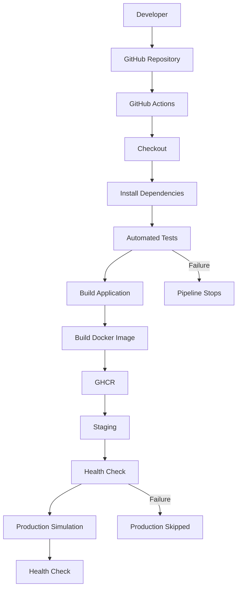

# Automated Multi-Stage CI/CD Pipeline for a Containerized Web Application

## Project Overview
This project is a simple but complete DevOps demonstration for the IBM Q2D Project 21 case study. It shows how a small Node.js and Express application can move through a modern CI/CD workflow with automated testing, containerization, staging simulation, production simulation, and image publishing to GitHub Container Registry (GHCR).

## Problem Statement
Manual deployment is slow, error-prone, and hard to reproduce. CI/CD automation improves quality by validating code, running tests, building container images, and deploying safely in stages.

## Objectives
- Demonstrate source checkout, dependency installation, testing, build, and Dockerization
- Show a simple multi-stage pipeline in GitHub Actions
- Publish a container image to GHCR
- Simulate staging and production deployment with health checks
- Keep the solution beginner-friendly and easy to explain

## Architecture


## Technology Stack
| Layer | Technology |
| --- | --- |
| Application | Node.js, Express.js |
| Frontend | HTML, CSS, JavaScript |
| Testing | Jest, Supertest |
| Containerization | Docker, Docker Compose |
| CI/CD | GitHub Actions |
| Registry | GitHub Container Registry (GHCR) |

## Project Structure
- src/app.js: Express application and routes
- src/server.js: Starts the server
- public/: static HTML, CSS, and JavaScript files
- tests/app.test.js: automated endpoint tests
- .github/workflows/ci-cd.yml: CI/CD pipeline definition
- Dockerfile: container image definition
- docker-compose*.yml: local deployment examples for development, staging, and production

## Local Setup
Install dependencies:
```bash
npm install
```

Run tests:
```bash
npm test
```

Build the application package:
```bash
npm run build
```

Start the application:
```bash
npm start
```

## Docker
Build the image:
```bash
docker build -t devflow .
```

Run the container:
```bash
docker run --rm -p 3000:3000 devflow
```

## Docker Compose
Run the development environment:
```bash
docker compose up --build
```

Run the staging environment:
```bash
docker compose -f docker-compose.staging.yml up --build
```

Run the production simulation:
```bash
docker compose -f docker-compose.production.yml up --build
```

## CI/CD Pipeline
The workflow in .github/workflows/ci-cd.yml includes these stages:
1. Checkout
2. Install dependencies
3. Run tests
4. Build application
5. Build Docker image
6. Run container health check
7. Push image to GHCR
8. Deploy to staging
9. Check staging health
10. Deploy to production simulation
11. Check production health

## Staging
The staging environment uses docker-compose.staging.yml and exposes the app on port 3001. It is a local staging simulation for the competition demo.

## Production
The production environment uses docker-compose.production.yml and exposes the app on port 3002. This is a local production simulation only. It is not a real cloud production deployment.

## Health Checks
Each container includes a simple health check against /api/health. The pipeline fails if the health endpoint is not successful.

## Failure Handling
The pipeline stops when tests fail, the Docker image cannot be built, or the health checks fail. Production depends on successful staging.

## GitHub Container Registry
The workflow logs into GHCR using the built-in GITHUB_TOKEN and pushes the image to ghcr.io/<owner>/devflow:latest. No credentials are stored in the repository.

## GitHub Actions
To use this workflow:
1. Create a GitHub repository
2. Push the code to GitHub
3. Open the Actions tab
4. Enable workflows if prompted
5. Ensure the repository has Actions permission to read/write packages

## Testing
The automated tests confirm:
- the homepage loads correctly
- /api/health returns a healthy JSON response
- /api/info returns the expected metadata

## IBM Q2D Demonstration Flow
1. Push code to GitHub
2. GitHub Actions starts the workflow
3. Tests run and must pass
4. The build stage runs
5. A Docker image is created
6. The image is pushed to GHCR
7. The staging environment starts
8. The staging health check passes
9. The production simulation starts
10. The production health check passes

## Failure Demonstration
To safely show a pipeline failure:
1. Temporarily break a test or introduce a failing assertion
2. Push the change
3. Observe that the test job fails
4. Confirm that later deployment jobs do not run
5. Revert the change and push again
6. Watch the pipeline recover and succeed

## Limitations
- This project uses local Docker Compose for staging and production simulation.
- It is not a real cloud deployment to AWS, Azure, GCP, or Kubernetes.
- The design is intentionally simple for undergraduate competition purposes.

## Future Enhancements
Possible next steps include Kubernetes, cloud deployment, Terraform, blue-green deployment, canary releases, and monitoring with Prometheus and Grafana.
